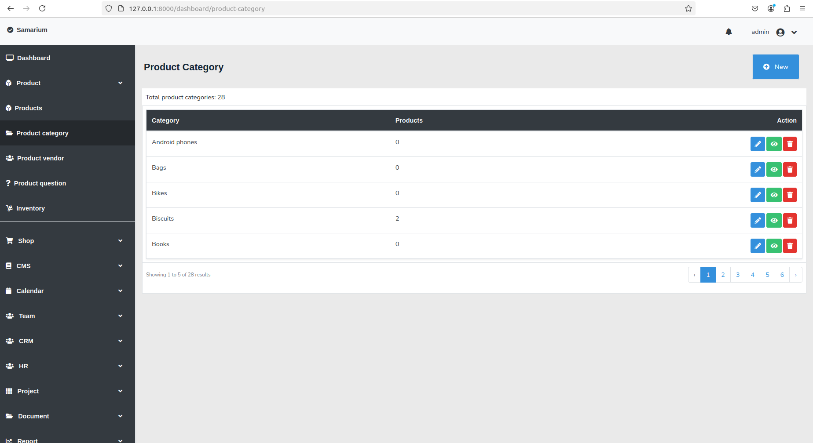
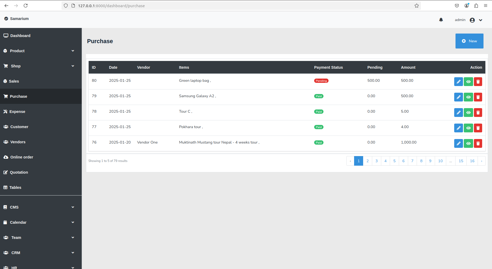

# Samarium

       

Open source ERP built with Laravel and Livewire.

## Features

Feature | Description
------- | -----------
Product | Create products from admin panel. This product can be added to invoices as well as displayed in the website.
Product Category | Arrange products by product categories. 
Invoicing | Create and manage sale invoice, purchase and expense entries.
Website Management (CMS) | Create and manage webpage and blog post entries.
Calendar | Create and manage calendar events.
Team | Create and manage teams.
Contact Message | View contact messages sent by website visitors 
Appointment | Get appointment request from website visitors. Approve or reject from admin panel.
Newsletter subscription | Get newsletter subscription request from website visitors.
Task Manager | Create and manage tasks.
Users  | Create and manage users.


## Installation

It is just another laravel application. So we do all the steps required to get a
laravel application working. 

### Pre requisites

Below applications must be installed in the system. 

```
php >= 8.2
mysql >= 8.0
composer
npm
```

### Step by step instructions

Perform below steps to get the application running.

```
git clone https://github.com/oitcode/samarium.git
```

```
cd samarium
```

```
cp env.example .env
```

Now create a mysql database. Then grant access to the mysql user. 
Lets assume you created database named `demo_database` and you granted
access to mysql user `demo_user`. Next, enter database name, mysql username
and mysql password in the .env file.  Your .env file's database part should
be like this.

```
DB_DATABASE=demo_database
DB_USERNAME=demo_user
DB_PASSWORD='demo_password'
```
Please replace `demo_database`, `demo_user` and `demo_password` with real
database name, username and password.

```
composer install
```

```
npm install
```

```
npm run dev
```

```
php artisan migrate
```

```
php artisan key:generate
```

```
php artisan storage:link
```

## Creating first user

To use the dashboard, you need a username and password.
Use below seeder file to create first user. This will create
an admin user. After that you can create other users from
dashboard.

`php artisan db:seed --class=UserSeeder`
 
## Running the app

`php artisan serve`

Now open your web browser and visit 
- `127.0.0.1:8000` to see the website
- `127.0.0.1:8000/dashboard` to see the dashboard

## Screenshots

Below are some screenshots.







### GIFs


## Configuration

Please check `app/config.php` file to see different configuration options
for the application. Below are some configuration options you may want to
change.  

File:                    `app/config.php`
Configurable option:     `App menu color options`

```
'app_menu_dropdown_button_text_color' => 'text-white',
'app_menu_normal_button_text_color'   => 'text-white',
'app_menu_bg_color'                   => 'bg-dark',

'app_top_menu_bg_color'               => 'bg-light',
'app_top_menu_text_color'             => 'text-dark',
```

## Contributing

Please consider contributing to this project. Any kind of contributions are welcome.
You can contribute in following ways:

Task    | How to contribute
------- | -----------
Raising issues | You can raise issues for existing bugs. Or you can raise issue for requesting new features.
Fixing issues | You can fix issues that are raised here in github repo.
Implement new feature | You can add new features to this application. Pull requests are welcome.
Refactor existing feature | Please refactor the code if something can be done better. Pull requests are welcome.
Adding test code | More test code is needed to automate as much test as possible. You can add more test code. 
Improve documentation | You can help by improving the documentation.

## Issues

If you find any issue in this application, you can help by raising an issue here in our github repo.

## Support

Please star this repository to show your support if you find this project useful and/or interesting.

## License

[MIT license](https://opensource.org/licenses/MIT)
